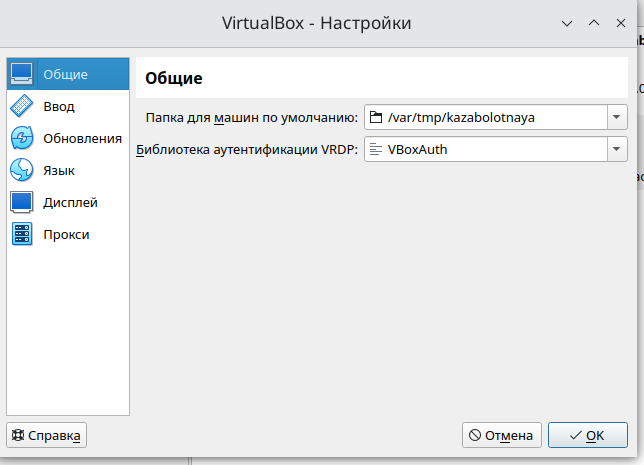
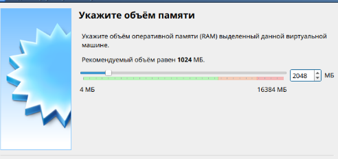
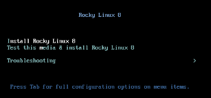

---
## Front matter
title: "Лабораторная работа №1"
subtitle: "Установка и конфигурация операционной системы на виртуальную машину"
author: "Заболотная Кристина Александровна"

## Generic otions
lang: ru-RU
toc-title: "Содержание"

## Bibliography
bibliography: bib/cite.bib
csl: pandoc/csl/gost-r-7-0-5-2008-numeric.csl

## Pdf output format
toc: true # Table of contents
toc-depth: 2
lof: true # List of figures
lot: true # List of tables
fontsize: 12pt
linestretch: 1.5
papersize: a4
documentclass: scrreprt
## I18n polyglossia
polyglossia-lang:
  name: russian
  options:
	- spelling=modern
	- babelshorthands=true
polyglossia-otherlangs:
  name: english
## I18n babel
babel-lang: russian
babel-otherlangs: english
## Fonts
mainfont: PT Serif
romanfont: PT Serif
sansfont: PT Sans
monofont: PT Mono
mainfontoptions: Ligatures=TeX
romanfontoptions: Ligatures=TeX
sansfontoptions: Ligatures=TeX,Scale=MatchLowercase
monofontoptions: Scale=MatchLowercase,Scale=0.9
## Biblatex
biblatex: true
biblio-style: "gost-numeric"
biblatexoptions:
  - parentracker=true
  - backend=biber
  - hyperref=auto
  - language=auto
  - autolang=other*
  - citestyle=gost-numeric
## Pandoc-crossref LaTeX customization
figureTitle: "Рис."
tableTitle: "Таблица"
listingTitle: "Листинг"
lofTitle: "Список иллюстраций"
lotTitle: "Список таблиц"
lolTitle: "Листинги"
## Misc options
indent: true
header-includes:
  - \usepackage{indentfirst}
  - \usepackage{float} # keep figures where there are in the text
  - \floatplacement{figure}{H} # keep figures where there are in the text
---

# Цель работы

Целью данной работы является приобретение практических навыков установки операционной системы на виртуальную машину, настройки минимально необходимых для дальнейшей работы сервисов.

# Задание

В окне терминала проанализировать последовательность загрузки системы, выполнив команду dmesg. Можно просто просмотреть вывод этой команды: dmesg | less.
Можно использовать поиск с помощью grep:
dmesg | grep -i "то, что ищем"

1. Версия ядра Linux (Linux version).
2. Частота процессора (Detected Mhz processor).
3. Модель процессора (CPU0).
4. Объем доступной оперативной памяти (Memory available).
5. Тип обнаруженного гипервизора (Hypervisor detected).
6. Тип файловой системы корневого раздела.
7. Последовательность монтирования файловых систем.

# Выполнение лабораторной работы

1. Осуществили вход в систему. Запустили терминал. Перешли в каталог /var/tmp - cd /var/tmp. 
Создали каталог с именем пользователя (совпадающий с логином студента в дисплейном классе). Для этого можно использовать команду: mkdir /var/tmp/`id -un`. Установили верное расположение каталога для виртуальных машин. 

{#fig:001 width=90%}

2. Создали новую виртуальную машину. Для этого в VirtualBox выбрали Машина - Создать. Указали имя виртуальной машины. 

{#fig:002 width=90%}

3. Папка для машин по умолчнию. 

{#fig:003 width=90%}

4. Укажите размер основной памяти виртуальной машины — 2048 МБ или большее число, кратное 1024 МБ. 

{#fig:004 width=90%}

5. Запускаем виртуальную машину. 

{#fig:005 width=90%}

6. Устанавливаем русский интерфейс ОС.

{#fig:006 width=90%}

7. Настройка установки образа ОС.

{#fig:007 width=90%}

8. Установка пароля для root.

{#fig:008 width=90%}

9. Завершение установки ОС. 

{#fig:009 width=90%}

10. Выполнение задания dmesg | grep -i со всеми 7 перечисленными пунктами. 

{#fig:010 width=90%}

# Контрольные вопросы

1. Какую информацию содержит учётная запись пользователя?
2. Укажите команды терминала и приведите примеры:
– для получения справки по команде;
– для перемещения по файловой системе;
– для просмотра содержимого каталога;
– для определения объёма каталога;
– для создания / удаления каталогов / файлов;
– для задания определённых прав на файл / каталог;
– для просмотра истории команд.
3. Что такое файловая система? Приведите примеры с краткой характери-
стикой.
4. Как посмотреть, какие файловые системы подмонтированы в ОС?
5. Как удалить зависший процесс?

## Ответы на контрольные вопросы

1. Здесь имя_пользователя — логин (учётная запись) студента в дисплейном классе. Если указан другой каталог, то требуется изменить его. Сведения, необходимые для опознания пользователя при подключении к системе, сведения для авторизации и учёта
2. man ls; cd /home/user/ ; ls -l; du -sh ; rm -r; chmod 657.
3. Файловая система - это способ организации и хранения файлов на устройстве хранения данных, таком как жесткий диск или SSD. Файловая система определяет структуру файлов, их именование, доступ к данным и другие атрибуты. Примеры файловых систем:
*FAT32*: Простая файловая система, поддерживаемая многими операционными системами. Однако, она имеет ограничения на размер файлов (4 ГБ).
*NTFS*: Файловая система Windows, которая поддерживает большие файлы и обладает расширенными функциями безопасности.
*ext4*: Файловая система Linux, обеспечивающая хорошую производительность и надежность.
*APFS*: Файловая система, разработанная Apple для macOS и iOS, обеспечивающая высокую скорость работы и безопасность данных.
4. Для просмотра подмонтированных файловых систем в операционной системе Linux можно использовать команду df (disk free). Пример:
df -h
Эта команда покажет информацию о всех подмонтированных файловых системах, их размере, использовании и точках монтирования.
5. Для удаления зависшего процесса в Linux можно воспользоваться командой kill. Сначала нужно определить идентификатор процесса (PID) с помощью команды ps (process status):
ps aux | grep <название_процесса>
Затем, используйте команду kill с опцией -9 для принудительного завершения процесса по его PID:
kill -9 <PID>
Например:
kill -9 1234
Где 1234 - PID зависшего процесса.

# Выводы

В ходе выполнения данной лабораторной работы мы приобрели практические навыки установки операционной системы на виртуальную машину, настройки минимально необходимых для дальнейшей работы сервисов.

# Список литературы{.unnumbered}

::: {#refs}
:::
