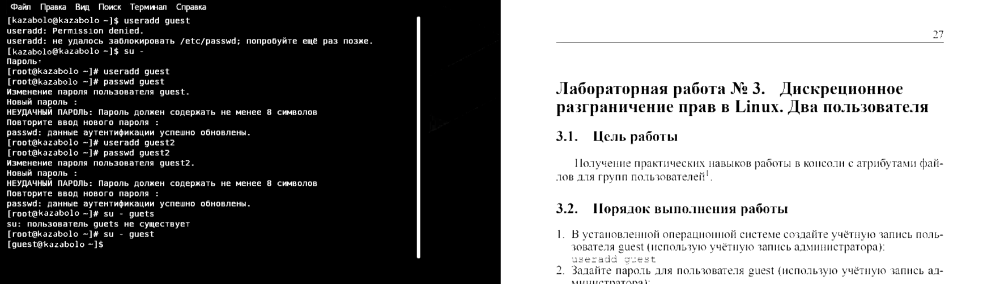
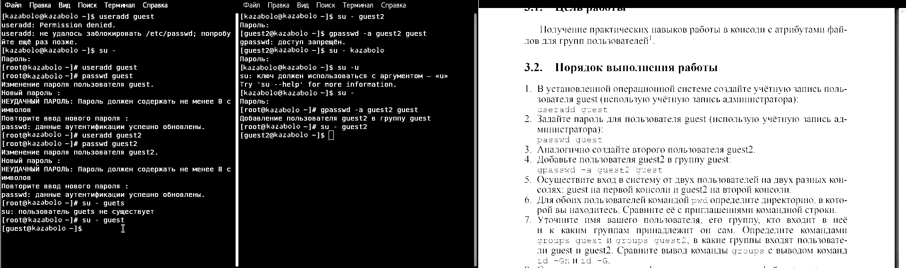
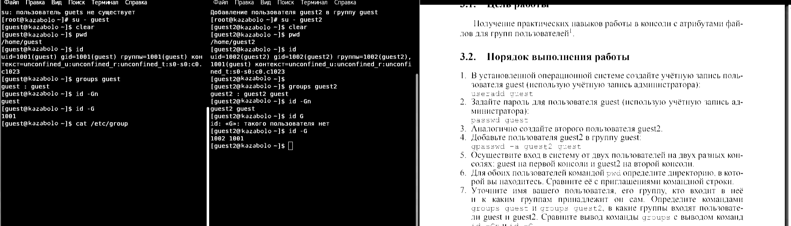
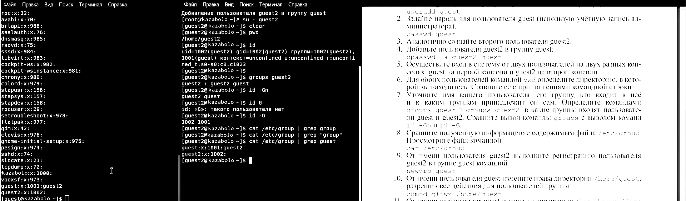
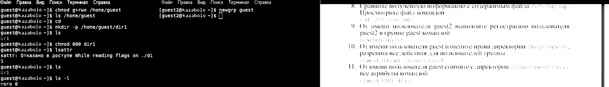
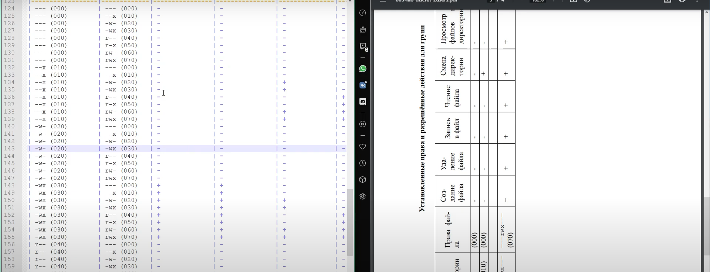
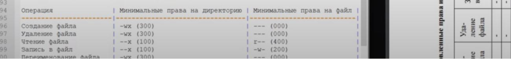

---
## Front matter
lang: ru-RU
title: Лабораторная работа № 3
subtitle: Дискреционное разграничение прав в Linux. Два пользователя
author:
  - Заболотная Кристина Александровна
institute:
  - Российский университет дружбы народов, Москва, Россия

## i18n babel
babel-lang: russian
babel-otherlangs: english

## Formatting pdf
toc: false
toc-title: Содержание
slide_level: 2
aspectratio: 169
section-titles: true
theme: metropolis
header-includes:
 - \metroset{progressbar=frametitle,sectionpage=progressbar,numbering=fraction}
 - '\makeatletter'
 - '\beamer@ignorenonframefalse'
 - '\makeatother'
---

# Вводная часть

## Цели и задачи

Получение практических навыков работы в консоли с атрибутами файлов для групп пользователей.

## Выполнение лабораторной работы

1. В установленной операционной системе создали учётную запись пользователя guest (использую учётную запись администратора): useradd guest. Задали пароль для пользователя guest: passwd guest. Аналогично создали второго пользователя guest2. 

##

{#fig:001 width=90%}

##

2. Добавили пользователя guest2 в группу guest: gpasswd -a guest2 guest. 

##

{#fig:002 width=90%}

##

3. Осуществили вход в систему от двух пользователей на двух разных консолях: guest на первой консоли и guest2 на второй консоли. Для обоих пользователей командой pwd определили директорию, в которой находимся. Сравнили её с приглашениями командной строки. Уточнили имя пользователя, его группу, кто входит в неё и к каким группам принадлежит он сам. Определили  командами groups guest и groups guest2, в какие группы входят пользователи guest и guest2. Сравнили вывод команды groups с выводом команд id -Gn и id -G.

##

{#fig:003 width=90%}

##

4. Сравнили полученную информацию с содержимым файла /etc/group. Просмотрели файл командой cat /etc/group. 

##

{#fig:004 width=90%}

##

5. От имени пользователя guest2 выполнили регистрацию пользователя guest2 в группе guest командой newgrp guest. От имени пользователя guest изменили права директории /home/guest, разрешив все действия для пользователей группы: chmod g+rwx /home/guest. От имени пользователя guest сняли с директории /home/guest/dir1 все атрибуты командой chmod 000 dirl. 

##

{#fig:005 width=90%}

##

6. Меняя атрибуты у директории dir1 и файла file1 от имени пользователя guest и делая проверку от пользователя guest2, заполнили табл. 3.1, определив опытным путём, какие операции разрешены, а какие нет.

##

{#fig:006 width=90%}

##

7. Сравнили табл. 2.1 и табл. 3.1. На основании заполненной таблицы определили те или иные минимально необходимые права для выполнения пользователем guest2 операций внутри директории dir1 и заполнили табл. 3.2.

##

{#fig:007 width=90%}

##

# Выводы

Получили практические навыки работы в консоли с атрибутами файлов для групп пользователей.

