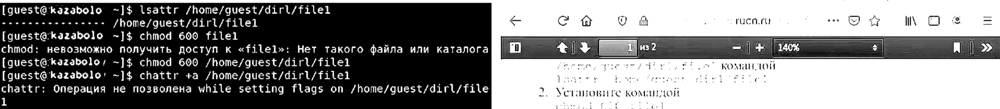
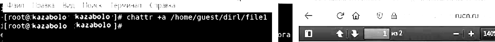
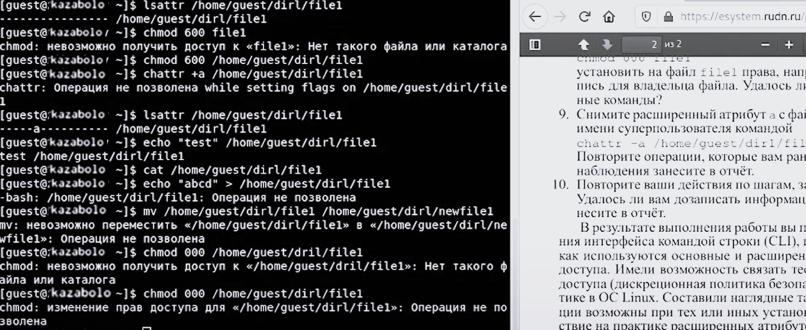
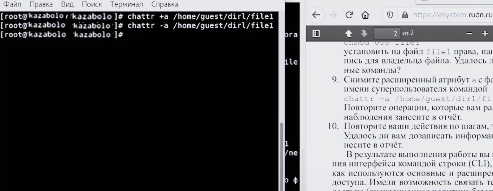
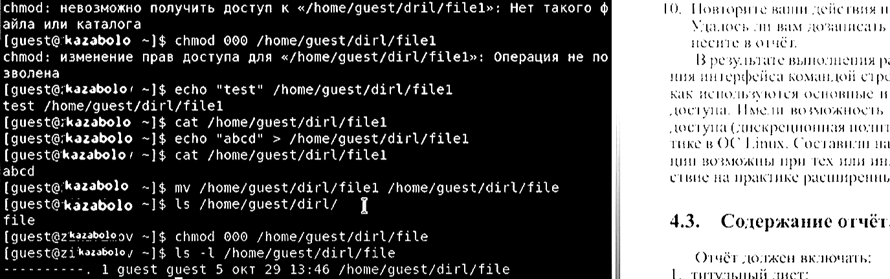
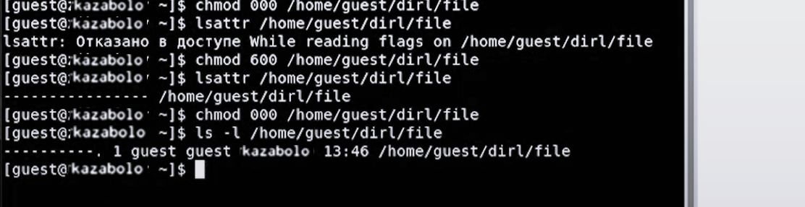

---
## Front matter
lang: ru-RU
title: Лабораторная работа № 4
subtitle: Дискреционное разграничение прав в Linux. Расширенные атрибуты
author:
 - Заболотная Кристина Александровна
institute:
  - Российский университет дружбы народов, Москва, Россия

## i18n babel
babel-lang: russian
babel-otherlangs: english

## Formatting pdf
toc: false
toc-title: Содержание
slide_level: 2
aspectratio: 169
section-titles: true
theme: metropolis
header-includes:
 - \metroset{progressbar=frametitle,sectionpage=progressbar,numbering=fraction}
 - '\makeatletter'
 - '\beamer@ignorenonframefalse'
 - '\makeatother'
---

# Информация

## Цели и задачи

Получение практических навыков работы в консоли с расширенными атрибутами файлов.

## Содержание исследования

1. От имени пользователя guest определили расширенные атрибуты файла
/home/guest/dir1/file1 командой lsattr /home/guest/dir1/file1
Установили командой chmod 600 file1 на файл file1 права, разрешающие чтение и запись для владельца файла. Попробовали установить на файл /home/guest/dir1/file1 расширенный атрибут a от имени пользователя guest: chattr +a /home/guest/dir1/file1
В ответ получили отказ от выполнения операции.

##

{#fig:001 width=90%}

##

2. Зашли на третью консоль с правами администратора. Попробовали установить расширенный атрибут на файл /home/guest/dir1/file1 от имени суперпользователя: chattr +a /home/guest/dir1/file1

##

{#fig:002 width=90%}

##

3. От пользователя guest проверели правильность установления атрибута:
lsattr /home/guest/dir1/file1
Выполнили дозапись в файл file1 слова «test» командой echo "test" /home/guest/dir1/file1
После этого выполнили чтение файла file1 командой cat /home/guest/dir1/file1
Убедились, что слово test было успешно записано в file1.
Попробовали удалить файл file1, либо стереть имеющуюся в нём информацию командой
echo "abcd" > /home/guest/dirl/file1
Попробовали переименовать файл. Попробовали с помощью команды chmod 000 file1 установить на файл file1 права, например, запрещающие чтение и запись для владельца файла. 

##

{#fig:003 width=90%}

##

4. Сняли расширенный атрибут a с файла /home/guest/dirl/file1 от имени суперпользователя командой
chattr -a /home/guest/dir1/file1

##

{#fig:004 width=90%}

##

5. Повторили операции, которые ранее не удавалось выполнить. 

##

{#fig:005 width=90%}

##

6. Операция chattr +i. 

##

{#fig:006 width=90%}

##

7. Повторили действия по шагам, заменив атрибут «a» атрибутом «i».

##

{#fig:007 width=90%}

##

## Итоговый слайд

В ходе выполнения данной лабораторной работы были получены практические навыки работы в консоли с расширенными атрибутами файлов. В результате выполнения работы повысили свои навыки использования интерфейса командой строки (CLI), познакомились на примерах с тем, как используются основные и расширенные атрибуты при разграничении доступа. Имели возможность связать теорию дискреционного разделения доступа (дискреционная политика безопасности) с её реализацией на практике в ОС Linux. Составили наглядные таблицы, поясняющие какие операции возможны при тех или иных установленных правах. Опробовали действие на практике расширенных атрибутов «а» и «i».

