---
## Front matter
lang: ru-RU
title: Лабораторная работа № 6
subtitle: Мандатное разграничение прав в Linux
author:
 - Заболотная Кристина Александровна
institute:
  - Российский университет дружбы народов, Москва, Россия

## i18n babel
babel-lang: russian
babel-otherlangs: english

## Formatting pdf
toc: false
toc-title: Содержание
slide_level: 2
aspectratio: 169
section-titles: true
theme: metropolis
header-includes:
 - \metroset{progressbar=frametitle,sectionpage=progressbar,numbering=fraction}
 - '\makeatletter'
 - '\beamer@ignorenonframefalse'
 - '\makeatother'
---

# Информация

## Цели и задачи

Развить навыки администрирования ОС Linux. Получить первое практическое знакомство с технологией SELinux1. Проверить работу SELinx на практике совместно с веб-сервером Apache.

## Содержание исследования

Войдите в систему с полученными учётными данными и убедитесь, что SELinux работает в режиме enforcing политики targeted с помощью команд getenforce и sestatus.

##

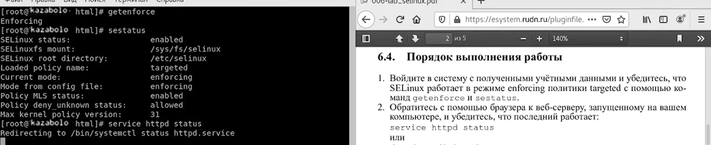{#fig:001 width=90%}

##

Обратитесь с помощью браузера к веб-серверу, запущенному на вашем компьютере, и убедитесь, что последний работает: service httpd status

##

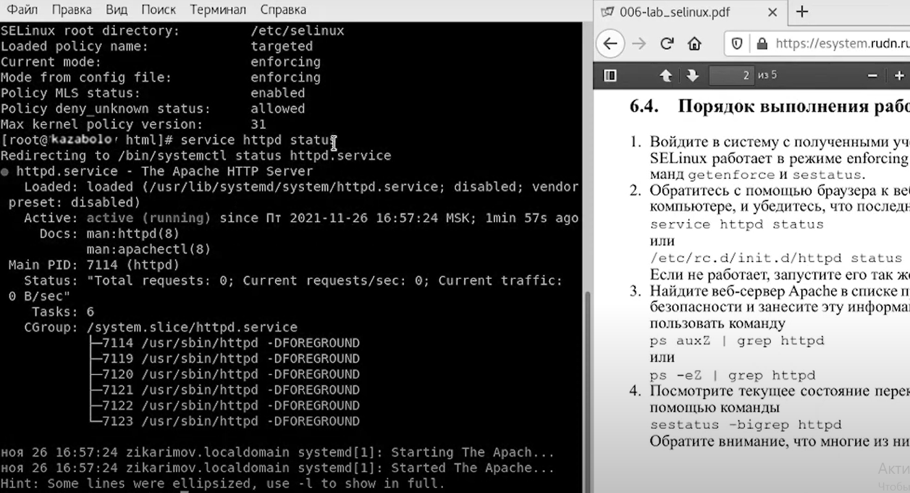{#fig:002 width=90%}

##

Найдите веб-сервер Apache в списке процессов, определите его контекст безопасности и занесите эту информацию в отчёт. Например, можно использовать команду ps auxZ | grep httpd

##

{#fig:003 width=90%}

##

Посмотрите текущее состояние переключателей SELinux для Apache с помощью команды sestatus -bigrep httpd Обратите внимание, что многие из них находятся в положении «off».

##

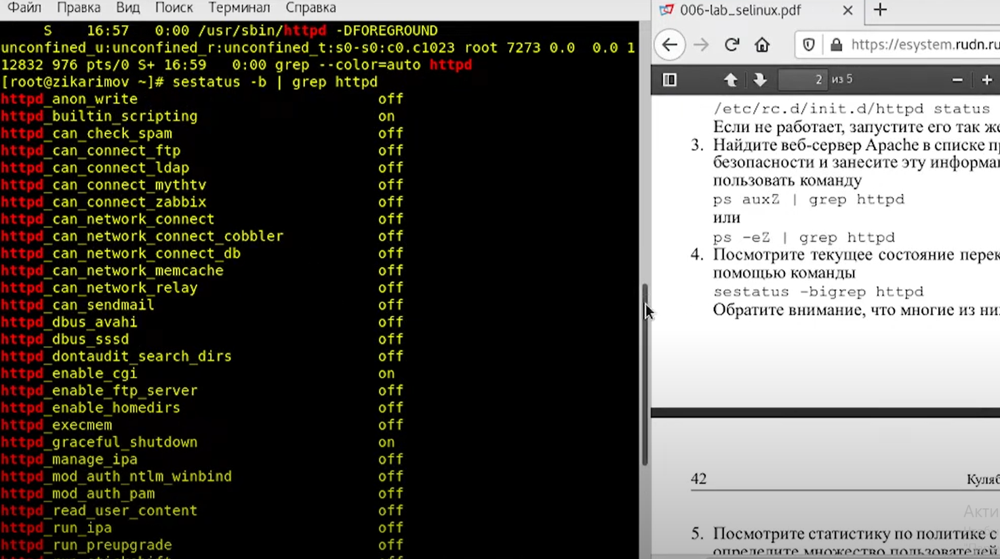{#fig:004 width=90%}

##

Посмотрите статистику по политике с помощью команды seinfo, также определите множество пользователей, ролей, типов.

##

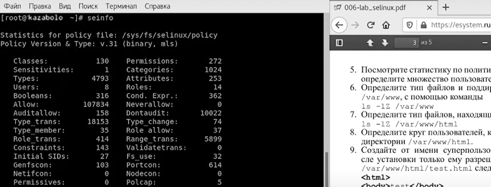{#fig:005 width=90%}

##

Определите тип файлов и поддиректорий, находящихся в директории /var/www, с помощью команды ls -lZ /var/www. Определите тип файлов, находящихся в директории /var/www/html: ls -lZ /var/www/html. Определите круг пользователей, которым разрешено создание файлов в директории /var/www/html.

##

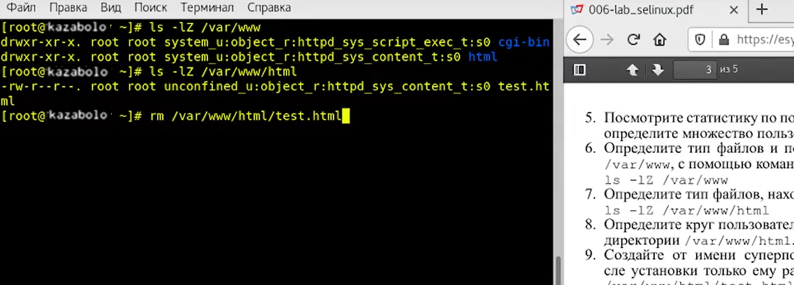{#fig:006 width=90%}

##

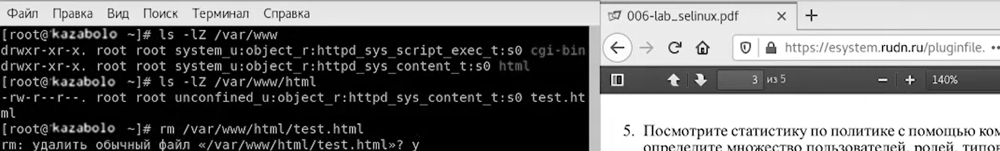{#fig:007 width=90%}

##

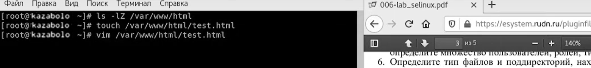{#fig:008 width=90%}

##

Создайте от имени суперпользователя (так как в дистрибутиве после установки только ему разрешена запись в директорию) html-файл /var/www/html/test.html.

##

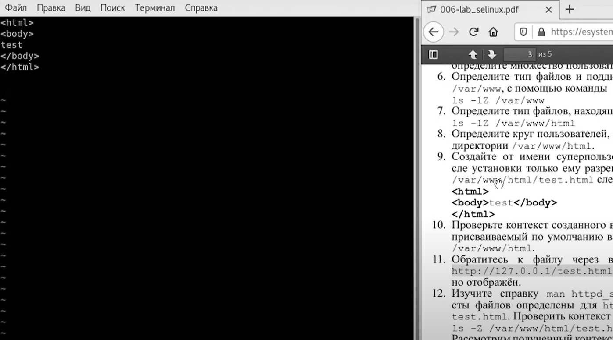{#fig:009 width=90%}

####

Проверьте контекст созданного вами файла. Занесите в отчёт контекст, присваиваемый по умолчанию вновь созданным файлам в директории /var/www/html.

##

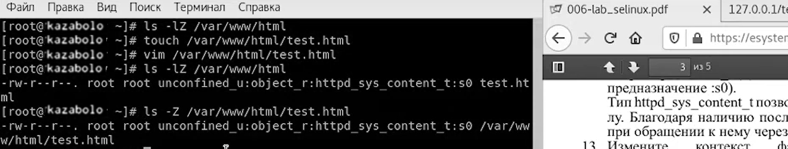{#fig:010 width=90%}

##

chon -t samba_share_t /var/www/html/test/html

##

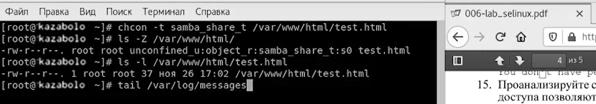{#fig:011 width=90%}

##

Измените контекст файла /var/www/html/test.html с httpd_sys_content_t на любой другой, к которому процесс httpd не должен иметь доступа, например, на samba_share_t: chcon -t samba_share_t /var/www/html/test.html, ls -Z /var/www/html/test.html

##

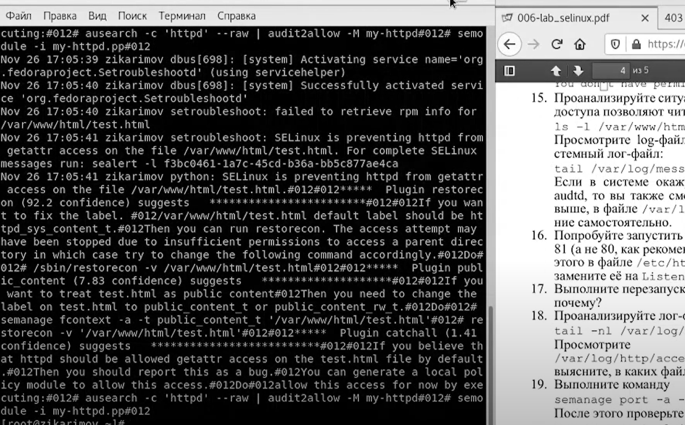{#fig:012 width=90%}

##

Проанализируйте ситуацию. Почему файл не был отображён, если права доступа позволяют читать этот файл любому пользователю? ls -l /var/www/html/test.html Просмотрите log-файлы веб-сервера Apache. Также просмотрите системный лог-файл: tail /var/log/messages. Если в системе окажутся запущенными процессы setroubleshootd и audtd, то вы также сможете увидеть ошибки, аналогичные указанным выше, в файле /var/log/audit/audit.log

##

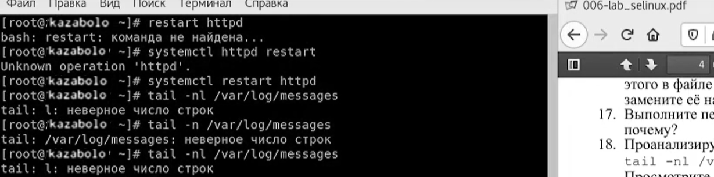{#fig:013 width=90%}

##

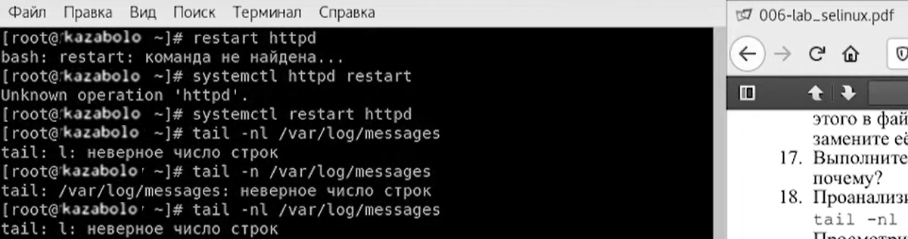{#fig:014 width=90%}

##

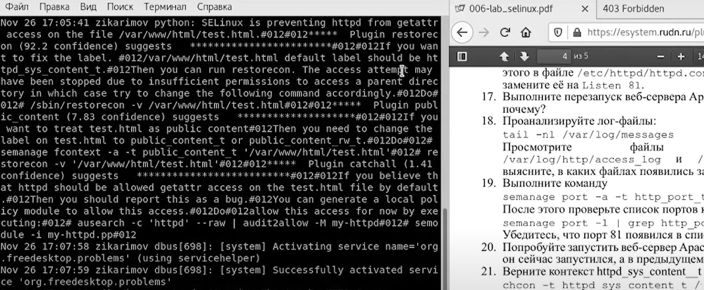{#fig:015 width=90%}

##

Удалите привязку http_port_t к 81 порту: semanage port -d -t http_port_t -p tcp 81
и проверьте, что порт 81 удалён. Удалите файл /var/www/html/test.html: rm /var/www/html/test.htm.

##

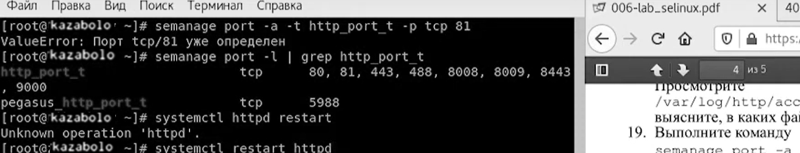{#fig:016 width=90%}

##

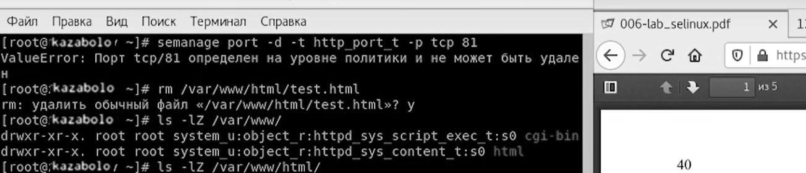{#fig:017 width=90%}

##

## Итоговый слайд

В ходе выполнения данной лабораторной работы были развиты навыки администрирования ОС Linux. Получить первое практическое знакомство с технологией SELinux1. Проверить работу SELinx на практике совместно с веб-сервером Apache.

