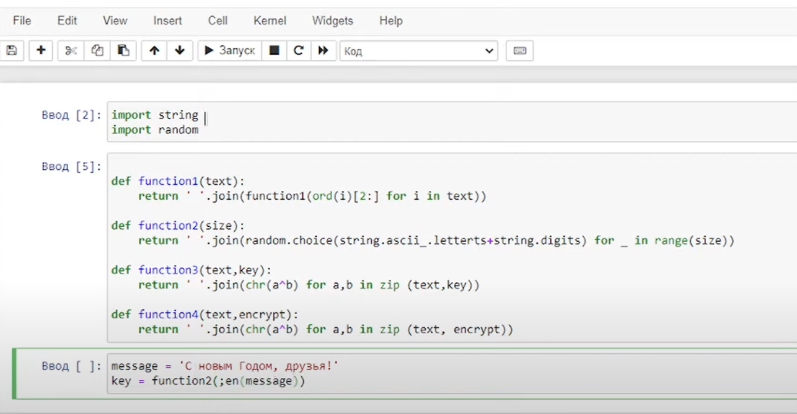
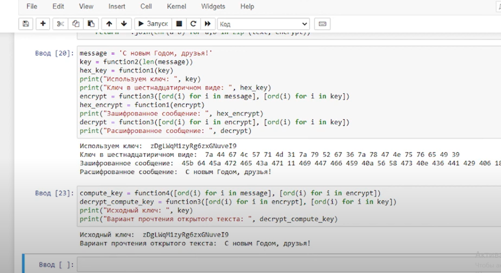

---
## Front matter
lang: ru-RU
title: Лабораторная работа № 7
subtitle: Элементы криптографии. Однократное гаммирование
author:
 - Заболотная Кристина Александровна
institute:
  - Российский университет дружбы народов, Москва, Россия

## i18n babel
babel-lang: russian
babel-otherlangs: english

## Formatting pdf
toc: false
toc-title: Содержание
slide_level: 2
aspectratio: 169
section-titles: true
theme: metropolis
header-includes:
 - \metroset{progressbar=frametitle,sectionpage=progressbar,numbering=fraction}
 - '\makeatletter'
 - '\beamer@ignorenonframefalse'
 - '\makeatother'
---

# Информация

## Цели и задачи

Освоить на практике применение режима однократного гаммирования.

## Содержание исследования

Нужно подобрать ключ, чтобы получить сообщение «С Новым Годом, друзья!». Требуется разработать приложение, позволяющее шифровать и дешифровать данные в режиме однократного гаммирования. Приложение должно:
Определить вид шифротекста при известном ключе и известном открытом тексте.

##

{#fig:001 width=90%}

##

Определить ключ, с помощью которого шифротекст может быть преобразован в некоторый фрагмент текста, представляющий собой один из возможных вариантов прочтения открытого текста.

##

{#fig:002 width=90%}

##

## Итоговый слайд

В ходе выполнения данной лабораторной работы были развиты навыки применения режима однократного гаммирования.

