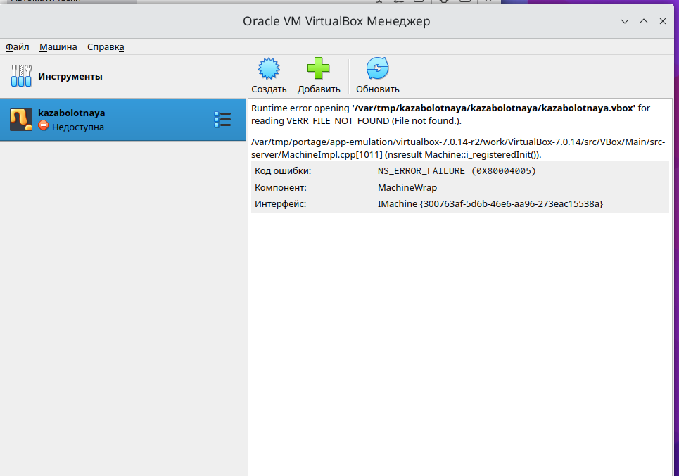
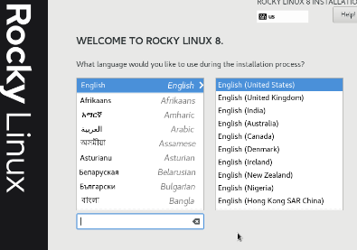
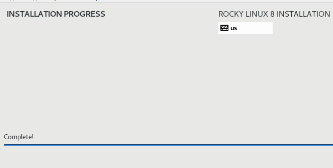

---
## Front matter
lang: ru-RU
title: Лабораторная работа №1
subtitle: Установка и конфигурация операционной системы на виртуальную машину
author:
  - Заболотная Кристина
institute:
  - Российский университет дружбы народов, Москва, Россия

## i18n babel
babel-lang: russian
babel-otherlangs: english

## Formatting pdf
toc: false
toc-title: Содержание
slide_level: 2
aspectratio: 169
section-titles: true
theme: metropolis
header-includes:
 - \metroset{progressbar=frametitle,sectionpage=progressbar,numbering=fraction}
 - '\makeatletter'
 - '\beamer@ignorenonframefalse'
 - '\makeatother'
---

# Информация

## Докладчик

  * Заболотная Кристина Александровна
  * Студент группы НБИбд-02-22
  * Российский университет дружбы народов

## Цели и задачи

Целью данной работы является приобретение практических навыков установки операционной системы на виртуальную машину, настройки минимально необходимых для дальнейшей работы сервисов.

## Содержание исследования

1. Осуществили вход в систему. Запустили терминал. Перешли в каталог /var/tmp - cd /var/tmp. 
Создали каталог с именем пользователя (совпадающий с логином студента в дисплейном классе). Для этого можно использовать команду: mkdir /var/tmp/`id -un`. Установили верное расположение каталога для виртуальных машин. 

{#fig:001 width=90%}

##

2. Создали новую виртуальную машину. Для этого в VirtualBox выбрали Машина - Создать. Указали имя виртуальной машины. 

{#fig:002 width=90%}

##

3. Папка для машин по умолчнию. 

{#fig:003 width=90%}

##

4. Укажите размер основной памяти виртуальной машины — 2048 МБ или большее число, кратное 1024 МБ. 

{#fig:004 width=90%}

##

5. Запускаем виртуальную машину. 

{#fig:005 width=90%}

##

6. Устанавливаем русский интерфейс ОС.

{#fig:006 width=90%}

##

7. Настройка установки образа ОС.

{#fig:007 width=90%}

##

8. Установка пароля для root.

{#fig:008 width=90%}

##

9. Завершение установки ОС. 

{#fig:009 width=90%}

## Итоговый слайд

В ходе выполнения данной лабораторной работы мы приобрели практические навыки установки операционной системы на виртуальную машину, настройки минимально необходимых для дальнейшей работы сервисов.

:::

